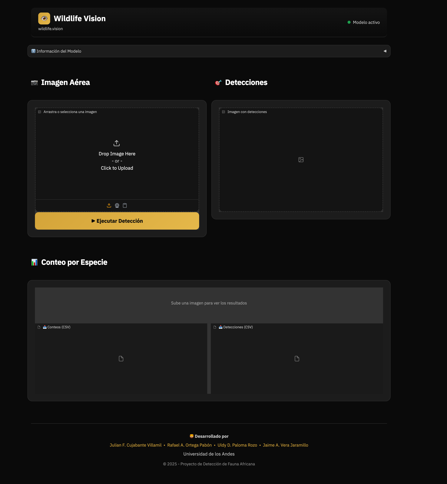
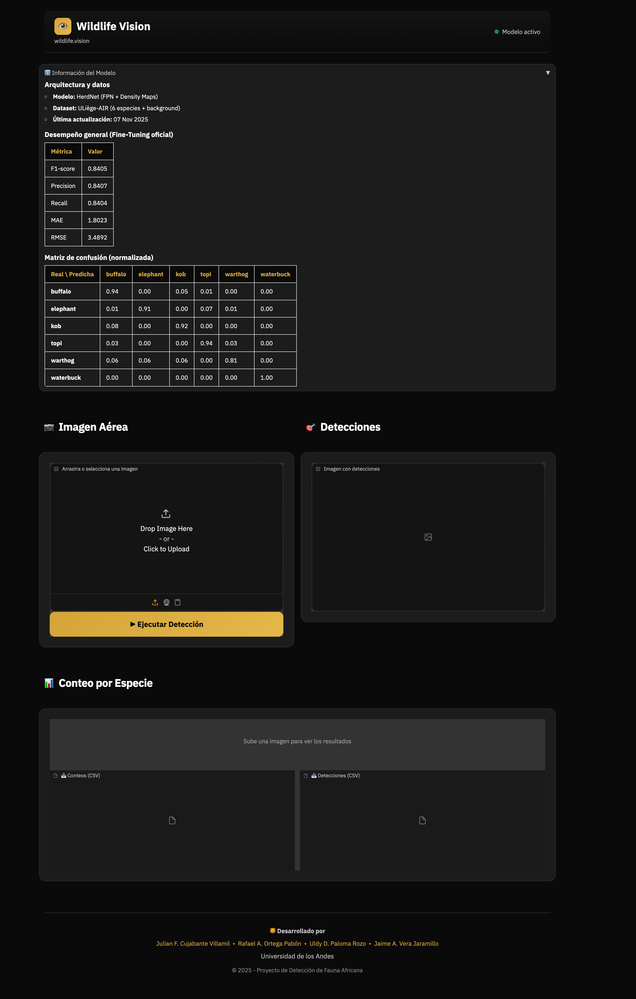

# 🦁 Wildlife Vision - Sistema de Detección y Conteo de Fauna Africana

<div align="center">



[](https://www.python.org/downloads/)
[](https://pytorch.org/)
[](https://gradio.app/)
[](https://www.docker.com/)
[](https://creativecommons.org/licenses/by-nc-sa/4.0/)

**Sistema de inteligencia artificial para detección y conteo automático de mamíferos africanos en imágenes aéreas**

[🌐 **Aplicación Desplegada**](https://wildlife.vision) | [📊 **Hugging Face Space**](https://huggingface.co/spaces/jaimevera1107/herdnet-app) | [📁 **Dataset ULiège-AIR**](https://dataverse.uliege.be/dataset.xhtml?persistentId=doi:10.58119/ULG/MIRUU5)

</div>

---

## 📋 Tabla de Contenidos

- [Descripción del Proyecto](#-descripción-del-proyecto)
- [Construido Con](#-construido-con)
- [Integrantes del Equipo](#-integrantes-del-equipo)
- [Primeros Pasos](#-primeros-pasos)
  - [Prerrequisitos](#prerrequisitos)
  - [Instalación](#instalación)
- [Uso](#-uso)
- [Arquitectura del Sistema](#-arquitectura-del-sistema)
- [Estructura del Repositorio](#-estructura-del-repositorio)
- [Parametrización](#-parametrización)
- [Guía de Despliegue](#-guía-de-despliegue)
- [Métricas del Modelo](#-métricas-del-modelo)
- [Roadmap](#-roadmap)
- [Contribuir](#-contribuir)
- [Documentación Adicional](#-documentación-adicional)
- [Licencia](#-licencia)
- [Contacto](#-contacto)
- [Agradecimientos](#-agradecimientos)

---

## 📖 Descripción del Proyecto

**Wildlife Vision** es un sistema de visión por computadora desarrollado para la detección y conteo automático de mamíferos africanos en imágenes aéreas capturadas por drones. El proyecto utiliza el modelo **HerdNet**, una arquitectura basada en Feature Pyramid Networks (FPN) con mapas de densidad, entrenado sobre el dataset **ULiège-AIR**.

### Especies Detectables

El sistema puede identificar y contar las siguientes 6 especies de mamíferos africanos:

| Especie | Emoji | Descripción |
|---------|-------|-------------|
| Buffalo | 🦬 | Búfalo africano |
| Elephant | 🐘 | Elefante africano |
| Kob | 🦌 | Antílope Kob |
| Topi | 🫎 | Antílope Topi |
| Warthog | 🐗 | Jabalí verrugoso |
| Waterbuck | 🦌 | Antílope acuático |

<p align="right">(<a href="#-tabla-de-contenidos">volver arriba</a>)</p>

---

## 🛠️ Construido Con

Este proyecto fue desarrollado utilizando las siguientes tecnologías y frameworks:

* [![Python][Python-badge]][Python-url]
* [![PyTorch][PyTorch-badge]][PyTorch-url]
* [![Gradio][Gradio-badge]][Gradio-url]
* [![Docker][Docker-badge]][Docker-url]
* [![OpenCV][OpenCV-badge]][OpenCV-url]

[Python-badge]: https://img.shields.io/badge/Python-3776AB?style=for-the-badge&logo=python&logoColor=white
[Python-url]: https://www.python.org/
[PyTorch-badge]: https://img.shields.io/badge/PyTorch-EE4C2C?style=for-the-badge&logo=pytorch&logoColor=white
[PyTorch-url]: https://pytorch.org/
[Gradio-badge]: https://img.shields.io/badge/Gradio-FF6F00?style=for-the-badge&logo=gradio&logoColor=white
[Gradio-url]: https://gradio.app/
[Docker-badge]: https://img.shields.io/badge/Docker-2496ED?style=for-the-badge&logo=docker&logoColor=white
[Docker-url]: https://www.docker.com/
[OpenCV-badge]: https://img.shields.io/badge/OpenCV-5C3EE8?style=for-the-badge&logo=opencv&logoColor=white
[OpenCV-url]: https://opencv.org/

<p align="right">(<a href="#-tabla-de-contenidos">volver arriba</a>)</p>

---

## 👥 Integrantes del Equipo

**Proyecto Guacamaya (CINFONIA)**  
**Maestría en Inteligencia Artificial - Universidad de los Andes**

| Nombre | Rol |
|--------|-----|
| **Jaime A. Vera Jaramillo** | Desarrollo del modelo y pipeline de entrenamiento |
| **Julián F. Cujabante Villamil** | Integración y documentación |
| **Rafael A. Ortega Pabón** | Infraestructura y despliegue |
| **Uldy D. Paloma Rozo** | Análisis de datos y evaluación |

<p align="right">(<a href="#-tabla-de-contenidos">volver arriba</a>)</p>

---

## ✨ Características Principales

- 🎯 **Detección multi-especie**: Identifica 6 especies de mamíferos africanos simultáneamente
- 📊 **Conteo automático**: Genera conteos precisos por especie y totales
- 🖼️ **Visualización de resultados**: Imagen anotada con puntos de detección
- 📥 **Exportación de datos**: Descarga de resultados en formato CSV
- 🚀 **Interfaz web intuitiva**: Aplicación Gradio con diseño moderno
- 🐳 **Contenedorización Docker**: Despliegue portable y reproducible
- ⚡ **Soporte GPU/CPU**: Optimizado para ambos entornos
- 📱 **Diseño responsive**: Funciona en dispositivos móviles y desktop

<p align="right">(<a href="#-tabla-de-contenidos">volver arriba</a>)</p>

---

## 🚀 Primeros Pasos

A continuación se describen los pasos para configurar el proyecto localmente.

### Prerrequisitos

Asegúrese de tener instalado lo siguiente:

* **Python 3.10+**
  ```bash
  python --version
  ```
* **pip** (gestor de paquetes)
  ```bash
  pip --version
  ```
* **Git**
  ```bash
  git --version
  ```
* **DVC** (para descargar datos y modelos)
  ```bash
  pip install dvc
  ```
* **Docker** (opcional, para despliegue containerizado)

### Dependencias Principales

Las siguientes son las dependencias principales del proyecto (versiones en `requirements.txt`):

| Paquete | Versión | Descripción |
|---------|---------|-------------|
| torch | 2.9.0 | Framework de deep learning |
| torchvision | 0.24.0 | Utilidades de visión para PyTorch |
| gradio | 5.49.1 | Framework para interfaces web |
| albumentations | 2.0.8 | Aumentación de imágenes |
| opencv-python-headless | 4.12.0.88 | Procesamiento de imágenes |
| pandas | 2.3.3 | Manipulación de datos |
| numpy | 2.2.6 | Computación numérica |
| scikit-learn | 1.7.2 | Machine learning |
| animaloc | 0.2.1 | HerdNet (desde GitHub) |
| wandb | 0.22.3 | Logging de experimentos |

### Instalación

1. **Clonar el repositorio**
   ```bash
   git clone https://github.com/jaimevera1107/aerial-wildlife-count.git
   cd aerial-wildlife-count
   ```

2. **Crear y activar entorno virtual**
   ```bash
   python -m venv venv
   source venv/bin/activate  # Linux/Mac
   # o
   .\venv\Scripts\activate   # Windows
   ```

3. **Instalar dependencias**
   ```bash
   pip install -r requirements.txt
   ```

4. **Descargar datos y modelos con DVC**
   ```bash
   # Descargar el modelo (requerido)
   dvc pull modelos/herdnet_best.pth.dvc
   dvc pull resources/models/herdnet_best.pth.dvc
   
   # Opcional: Descargar dataset completo (~33 GB)
   dvc pull
   ```

5. **Ejecutar la aplicación**
   ```bash
   python app.py
   ```

6. **Abrir en el navegador**
   ```
   http://localhost:7860
   ```

<p align="right">(<a href="#-tabla-de-contenidos">volver arriba</a>)</p>

---

## 🏗️ Arquitectura del Sistema

```
┌─────────────────────────────────────────────────────────────────┐
│                        WILDLIFE VISION                          │
├─────────────────────────────────────────────────────────────────┤
│  ┌─────────────┐    ┌──────────────┐    ┌─────────────────┐    │
│  │   Gradio    │───▶│  HerdNet     │───▶│  Postproceso    │    │
│  │   Frontend  │    │  Inference   │    │  & Exportación  │    │
│  └─────────────┘    └──────────────┘    └─────────────────┘    │
│         │                  │                     │              │
│         ▼                  ▼                     ▼              │
│  ┌─────────────┐    ┌──────────────┐    ┌─────────────────┐    │
│  │   Upload    │    │   Sliding    │    │   CSV + Image   │    │
│  │   Image     │    │   Window     │    │   Annotated     │    │
│  └─────────────┘    └──────────────┘    └─────────────────┘    │
└─────────────────────────────────────────────────────────────────┘
```

### Pipeline de Inferencia

1. **Preprocesamiento**: Normalización y división en parches (sliding window)
2. **Inferencia**: Predicción con HerdNet + FPN
3. **Stitching**: Reconstrucción de detecciones globales con NMS
4. **Postprocesamiento**: Conteo por especie y anotación visual

<p align="right">(<a href="#-tabla-de-contenidos">volver arriba</a>)</p>

---

## 📁 Estructura del Repositorio

```
aerial-wildlife-count-main/
│
├── 📂 notebooks/                    # Cuadernos de análisis y entrenamiento
│   ├── full_herdnet_maia.ipynb     # Entrenamiento completo HerdNet
│   ├── full_herdnet_maia_plus.ipynb # Fine-tuning avanzado
│   ├── full_YOLO_maia.ipynb        # Comparativa con YOLOv11
│   ├── demo-training-testing-herdnet.ipynb
│   ├── augment.ipynb               # Aumentación de datos
│   ├── quality.ipynb               # Análisis de calidad
│   └── train_scratch.ipynb         # Entrenamiento desde cero
│
├── 📂 modelos/                      # Modelos entrenados
│   ├── herdnet_best.pth            # Modelo HerdNet final (PyTorch)
│   └── herdnet_best.pth.dvc        # Versionado con DVC
│
├── 📂 datos/                        # Muestras del dataset
│   ├── train/                      # Imágenes de entrenamiento
│   ├── val/                        # Imágenes de validación
│   ├── test/                       # Imágenes de prueba
│   ├── train_patches/              # Parches de entrenamiento
│   ├── val_patches/                # Parches de validación
│   ├── train.csv                   # Anotaciones de entrenamiento
│   ├── val.csv                     # Anotaciones de validación
│   ├── test.csv                    # Anotaciones de prueba
│   └── detections.csv              # Ejemplo de salida de detecciones
│
├── 📂 inference/                    # Módulos de inferencia
│   ├── herdnet_infer.py            # Motor de inferencia HerdNet
│   ├── preprocessing.py            # Preprocesamiento de imágenes
│   ├── postprocessing.py           # Postprocesamiento y visualización
│   └── utils_io.py                 # Utilidades de entrada/salida
│
├── 📂 resources/                    # Recursos y configuraciones
│   ├── configs/
│   │   └── default.yaml            # Configuración por defecto
│   ├── models/                     # Modelos (copia de modelos/)
│   ├── logs/                       # Logs de inferencia
│   └── outputs/                    # Resultados de inferencia
│
├── 📂 tools/                        # Herramientas adicionales
│   └── infer_optimized.py          # Inferencia optimizada
│
├── 📄 app.py                        # Aplicación principal Gradio
├── 📄 api_server.py                 # API REST (FastAPI)
├── 📄 Dockerfile                    # Imagen Docker (CUDA)
├── 📄 Dockerfile.arm64              # Imagen Docker (ARM64)
├── 📄 requirements.txt              # Dependencias Python
├── 📄 README.md                     # Este archivo
└── 📄 README_DVC.md                 # Documentación DVC
```

<p align="right">(<a href="#-tabla-de-contenidos">volver arriba</a>)</p>

---

## 🔧 Parametrización

El sistema permite ajustar parámetros de funcionamiento mediante archivos de configuración YAML y variables de entorno.

### Archivo de Configuración Principal

**`resources/configs/default.yaml`**

```yaml
# ===========================================
# Configuración del Modelo HerdNet
# ===========================================
model:
  name: "herdnet_fase1_best"
  path: "resources/models/herdnet_best.pth"  # Ruta al modelo
  device: "cuda"           # "cuda" para GPU, "cpu" para CPU
  patch_size: 512          # Tamaño del parche en píxeles
  overlap: 160             # Solapamiento entre parches
  down_ratio: 2            # Ratio de reducción

# ===========================================
# Rutas de Directorios
# ===========================================
paths:
  uploads_dir: "resources/uploads"   # Directorio de subidas
  outputs_dir: "resources/outputs"   # Directorio de salidas
  logs_dir: "resources/logs"         # Directorio de logs

# ===========================================
# Opciones de Inferencia
# ===========================================
inference:
  save_plots: true         # Guardar visualizaciones
  save_csv: true           # Guardar resultados en CSV
  save_thumbnails: false   # Guardar miniaturas de detecciones
  verbose: true            # Mostrar logs detallados
```

### Variables de Entorno

| Variable | Descripción | Valor por Defecto |
|----------|-------------|-------------------|
| `GRADIO_SERVER_NAME` | Dirección del servidor Gradio | `0.0.0.0` |
| `GRADIO_SERVER_PORT` | Puerto del servidor | `7860` |
| `MPLCONFIGDIR` | Directorio de configuración Matplotlib | `/tmp/matplotlib` |
| `CUDA_VISIBLE_DEVICES` | GPUs a utilizar | `0` |

### Ejemplo de Configuración Personalizada

```bash
# Ejecutar con GPU específica
CUDA_VISIBLE_DEVICES=1 python app.py

# Ejecutar en puerto diferente
GRADIO_SERVER_PORT=8080 python app.py

# Ejecutar solo en CPU
python -c "
import yaml
with open('resources/configs/default.yaml', 'r') as f:
    cfg = yaml.safe_load(f)
cfg['model']['device'] = 'cpu'
with open('resources/configs/default.yaml', 'w') as f:
    yaml.dump(cfg, f)
" && python app.py
```

> 📖 Para documentación completa de configuración, consulte [docs/CONFIGURACION.md](docs/CONFIGURACION.md)

<p align="right">(<a href="#-tabla-de-contenidos">volver arriba</a>)</p>

---

## 🚀 Guía de Despliegue

### Opción 1: Ejecución Local (Desarrollo)

```bash
# 1. Clonar repositorio
git clone https://github.com/jaimevera1107/aerial-wildlife-count.git
cd aerial-wildlife-count

# 2. Instalar dependencias
pip install -r requirements.txt

# 3. Ejecutar aplicación
python app.py

# 4. Abrir navegador
# http://localhost:7860
```

### Opción 2: Docker (Producción)

#### Construcción de la Imagen

```bash
# Para sistemas con GPU NVIDIA (x86_64)
docker build -t wildlife-detector .

# Para Apple Silicon (ARM64)
docker build -f Dockerfile.arm64 -t wildlife-detector .
```

#### Ejecución con GPU

```bash
docker run --gpus all -p 7860:7860 wildlife-detector
```

#### Ejecución sin GPU (CPU)

```bash
docker run -p 7860:7860 wildlife-detector
```

#### Docker Compose (Opcional)

```yaml
# docker-compose.yml
version: '3.8'
services:
  wildlife-vision:
    build: .
    ports:
      - "7860:7860"
    environment:
      - GRADIO_SERVER_NAME=0.0.0.0
    deploy:
      resources:
        reservations:
          devices:
            - driver: nvidia
              count: 1
              capabilities: [gpu]
```

```bash
docker-compose up -d
```

### Opción 3: Hugging Face Spaces

1. Crear un nuevo Space en [Hugging Face](https://huggingface.co/new-space)
2. Seleccionar **Docker** como SDK
3. Subir los siguientes archivos:
   - `Dockerfile`
   - `app.py`
   - `requirements.txt`
   - `resources/` (carpeta completa)
   - `modelos/` (carpeta completa)
   - `inference/` (carpeta completa)
4. Activar GPU si es necesario
5. La aplicación se desplegará automáticamente

### Verificación del Despliegue

```bash
# Verificar que el servidor está corriendo
curl http://localhost:7860

# Verificar salud de la API
curl http://localhost:7860/api/health
```

> 📖 Para instrucciones detalladas de despliegue, consulte el [Manual de Despliegue](docs/MANUAL_DESPLIEGUE.md)

<p align="right">(<a href="#-tabla-de-contenidos">volver arriba</a>)</p>

---

## 📝 Uso

_Para más ejemplos y documentación detallada, consulte el [Manual de Usuario](docs/MANUAL_USUARIO.md)_

### Uso de la Interfaz Web

1. **Acceder a la aplicación**: Navegar a [https://wildlife.vision](https://wildlife.vision)
2. **Subir imagen**: Arrastrar o hacer clic para seleccionar una imagen aérea
3. **Ejecutar detección**: Presionar el botón "▶ Ejecutar Detección"
4. **Ver resultados**: 
   - Imagen anotada con puntos de detección
   - Conteo por especie con barras de progreso
   - Total de animales detectados
5. **Descargar datos**: Exportar conteos y detecciones en CSV

#### Capturas de Pantalla

<details>
<summary>📸 Ver interfaz principal</summary>


</details>

<details>
<summary>📸 Ver información del modelo</summary>



</details>

> 📖 Para instrucciones detalladas, consulte el [Manual de Usuario](docs/MANUAL_USUARIO.md)

### Uso Programático (Python)

```python
from PIL import Image
from inference.herdnet_infer import HerdNetInference

# Inicializar motor de inferencia
engine = HerdNetInference("resources/configs/default.yaml")

# Cargar imagen
image = Image.open("mi_imagen_aerea.jpg")

# Ejecutar inferencia
annotated_image, counts = engine.infer_single(image)

# Mostrar resultados
print("Conteo por especie:")
for species, count in counts.items():
    print(f"  {species}: {count}")

# Guardar imagen anotada
annotated_image.save("resultado_deteccion.jpg")
```

### Uso con API REST

```bash
# Subir imagen para detección
curl -X POST "http://localhost:7860/api/detect" \
  -F "image=@mi_imagen.jpg" \
  -o resultado.json
```

<p align="right">(<a href="#-tabla-de-contenidos">volver arriba</a>)</p>

---

## 📊 Métricas del Modelo

### Desempeño General (Fine-Tuning Oficial)

| Métrica | Valor |
|---------|-------|
| **F1-score** | 0.8405 |
| **Precision** | 0.8407 |
| **Recall** | 0.8404 |
| **MAE** | 1.8023 |
| **RMSE** | 3.4892 |

### Matriz de Confusión (Normalizada)

| Real \ Predicha | buffalo | elephant | kob | topi | warthog | waterbuck |
|-----------------|---------|----------|-----|------|---------|-----------|
| **buffalo** | 0.94 | 0.00 | 0.05 | 0.01 | 0.00 | 0.00 |
| **elephant** | 0.01 | 0.91 | 0.00 | 0.07 | 0.01 | 0.00 |
| **kob** | 0.08 | 0.00 | 0.92 | 0.00 | 0.00 | 0.00 |
| **topi** | 0.03 | 0.00 | 0.00 | 0.94 | 0.03 | 0.00 |
| **warthog** | 0.06 | 0.06 | 0.06 | 0.00 | 0.81 | 0.00 |
| **waterbuck** | 0.00 | 0.00 | 0.00 | 0.00 | 0.00 | 1.00 |

<p align="right">(<a href="#-tabla-de-contenidos">volver arriba</a>)</p>

---

## 🗺️ Roadmap

- [x] Entrenamiento del modelo HerdNet con dataset ULiège-AIR
- [x] Implementación de interfaz web con Gradio
- [x] Despliegue en Hugging Face Spaces
- [x] Contenedorización con Docker
- [x] Despliegue en producción (wildlife.vision)
- [x] Documentación completa del proyecto
- [ ] Soporte para más especies de fauna
- [ ] API REST documentada con Swagger
- [ ] Procesamiento por lotes de múltiples imágenes
- [ ] Integración con sistemas de drones en tiempo real
- [ ] Modelo optimizado para edge devices (ONNX/TensorRT)

Consulte los [issues abiertos](https://github.com/jaimevera1107/aerial-wildlife-count/issues) para ver la lista completa de características propuestas y problemas conocidos.

<p align="right">(<a href="#-tabla-de-contenidos">volver arriba</a>)</p>

---

## 🤝 Contribuir

Las contribuciones son lo que hace que la comunidad de código abierto sea un lugar increíble para aprender, inspirar y crear. Cualquier contribución que hagas será **muy apreciada**.

Si tienes una sugerencia para mejorar esto, por favor haz un fork del repositorio y crea un pull request. También puedes simplemente abrir un issue con la etiqueta "enhancement".

1. Haz Fork del Proyecto
2. Crea tu Feature Branch (`git checkout -b feature/AmazingFeature`)
3. Haz Commit de tus Cambios (`git commit -m 'Add some AmazingFeature'`)
4. Haz Push a la Branch (`git push origin feature/AmazingFeature`)
5. Abre un Pull Request

### Guías de Contribución

- Sigue el estilo de código existente (PEP 8 para Python)
- Documenta las nuevas funcionalidades
- Añade tests cuando sea posible
- Actualiza la documentación si es necesario

<p align="right">(<a href="#-tabla-de-contenidos">volver arriba</a>)</p>

---

## 📚 Artefactos y Recursos

### Enlaces Importantes

| Recurso | URL |
|---------|-----|
| 🌐 **Aplicación Producción** | [https://wildlife.vision](https://wildlife.vision) |
| 🤗 **Hugging Face Space** | [jaimevera1107/herdnet-app](https://huggingface.co/spaces/jaimevera1107/herdnet-app) |
| 📊 **Dataset ULiège-AIR** | [DOI: 10.58119/ULG/MIRUU5](https://dataverse.uliege.be/dataset.xhtml?persistentId=doi:10.58119/ULG/MIRUU5) |
| 📁 **Artefactos (Drive)** | [Google Drive](https://drive.google.com/drive/folders/1oD3-ZtvEfPJtfDrBbefJ2JLMIWksVBK6) |
| 🔬 **HerdNet Original** | [GitHub - Alexandre-Delplanque/HerdNet](https://github.com/Alexandre-Delplanque/HerdNet) |

### Modelos Disponibles

| Modelo | Formato | Tamaño | Descripción |
|--------|---------|--------|-------------|
| `herdnet_best.pth` | PyTorch | ~200 MB | Modelo fine-tuned final |

<p align="right">(<a href="#-tabla-de-contenidos">volver arriba</a>)</p>

---

## 📚 Documentación Adicional

| Documento | Descripción |
|-----------|-------------|
| [🚀 Manual de Despliegue](docs/MANUAL_DESPLIEGUE.md) | Guía completa para desplegar en diferentes entornos |
| [📖 Manual de Usuario](docs/MANUAL_USUARIO.md) | Guía paso a paso para usar la aplicación |
| [🔧 Guía de Configuración](docs/CONFIGURACION.md) | Documentación detallada de parámetros y variables |
| [📊 README DVC](README_DVC.md) | Instrucciones para versionado de datos con DVC |

<p align="right">(<a href="#-tabla-de-contenidos">volver arriba</a>)</p>

---

## 📄 Licencia

Este proyecto está licenciado bajo **Creative Commons Attribution-NonCommercial-ShareAlike 4.0 International (CC BY-NC-SA 4.0)**.

[](https://creativecommons.org/licenses/by-nc-sa/4.0/)

### Términos Principales

- ✅ **Atribución**: Debe dar crédito apropiado
- ❌ **No Comercial**: No puede usar el material con fines comerciales
- 🔄 **Compartir Igual**: Si remezcla, transforma o crea a partir del material, debe distribuir sus contribuciones bajo la misma licencia

Consulte `LICENSE` para más información.

<p align="right">(<a href="#-tabla-de-contenidos">volver arriba</a>)</p>

---

## 📧 Contacto

**Proyecto Guacamaya (CINFONIA)** - Universidad de los Andes

| Integrante | Email | LinkedIn |
|------------|-------|----------|
| Jaime A. Vera Jaramillo | ja.vera@uniandes.edu.co | [LinkedIn](https://linkedin.com) |
| Julián F. Cujabante Villamil | jf.cujabante@uniandes.edu.co | [LinkedIn](https://linkedin.com) |
| Rafael A. Ortega Pabón | ra.ortegap@uniandes.edu.co | [LinkedIn](https://linkedin.com) |
| Uldy D. Paloma Rozo | ud.paloma@uniandes.edu.co | [LinkedIn](https://linkedin.com) |

**Enlace del Proyecto**: [https://github.com/jaimevera1107/aerial-wildlife-count](https://github.com/jaimevera1107/aerial-wildlife-count)

**Aplicación Desplegada**: [https://wildlife.vision](https://wildlife.vision)

<p align="right">(<a href="#-tabla-de-contenidos">volver arriba</a>)</p>

---

## 🙏 Agradecimientos

Recursos y personas que hicieron posible este proyecto:

- [Universidad de los Andes](https://uniandes.edu.co) - Maestría en Inteligencia Artificial
- [Alexandre Delplanque et al.](https://github.com/Alexandre-Delplanque/HerdNet) - Por el modelo HerdNet original
- [ULiège](https://www.uliege.be/) - Por el dataset ULiège-AIR
- [Hugging Face](https://huggingface.co/) - Por la infraestructura de despliegue
- [Best-README-Template](https://github.com/othneildrew/Best-README-Template) - Por el template de README
- [Shields.io](https://shields.io/) - Por los badges
- [Gradio](https://gradio.app/) - Por el framework de interfaz de usuario

<p align="right">(<a href="#-tabla-de-contenidos">volver arriba</a>)</p>

---

<div align="center">

**🦁 Wildlife Vision - Proyecto Guacamaya (CINFONIA)**

*Universidad de los Andes - Maestría en Inteligencia Artificial*

© 2025 - Todos los derechos reservados

</div>
